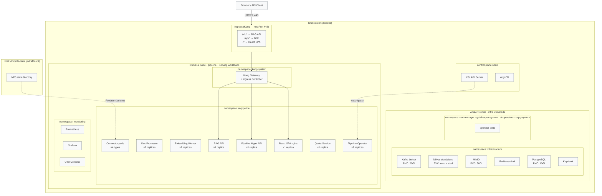

# AI Data Pipeline — Architecture Diagrams

Three static diagrams rendered in Mermaid. Renders natively on GitHub and most doc platforms.

---

## 1. Component Architecture

All services and their communication paths. Arrows show the primary data or control flow direction.

```mermaid
graph TB
    subgraph SOURCES["Data Sources"]
        S1[S3 / MinIO]
        S2[NFS Server]
        S3DB[PostgreSQL / MySQL]
        S4[Kafka Stream]
    end

    subgraph INGESTION["Ingestion  ·  ai-pipeline namespace"]
        C1[S3 Connector\nDeployment]
        C2[NFS Connector\nDeployment]
        C3[DB Connector\nDeployment]
        C4[Stream Connector\nDeployment]
    end

    subgraph MSGBUS["Message Bus  ·  infrastructure namespace"]
        KR[Kafka / KRaft\nStrimzi Operator]
        KT1([raw-documents\n4 partitions])
        KT2([document-chunks\n8 partitions])
        KT3([usage-events\n4 partitions])
        KT4([dlq-raw-documents])
        KT5([dlq-document-chunks])
    end

    subgraph PROCESSING["Processing  ·  ai-pipeline namespace"]
        DP[Document Processor\n2–4 replicas\nparse · chunk]
        EW[Embedding Worker\n2–4 replicas\nBGE-small / BGE-large / OpenAI]
    end

    subgraph STORAGE["Storage  ·  infrastructure namespace"]
        MV[Milvus Vector DB\nHNSW / IVF_FLAT]
        MN[MinIO\nblob store]
        RD[Redis\nquota counters\nquery cache]
        PG[PostgreSQL\nfile status\nworkspaces\nquotas]
    end

    subgraph CONTROL["Control Plane  ·  infrastructure namespace"]
        KC[Keycloak\nIAM / OIDC]
        KG[Kong OSS\nAPI Gateway]
        OPA[OPA\npolicy engine]
        QS[Quota Service\ngRPC]
        OM[OpenMeter\nusage metering]
    end

    subgraph SERVING["Serving  ·  ai-pipeline namespace"]
        RA[RAG API\nFastAPI]
        BFF[Pipeline Mgmt API\nBFF / FastAPI]
        UI[React SPA\nnginx]
    end

    subgraph OPS["Operators  ·  multiple namespaces"]
        PO[Pipeline Operator\nkopf]
        STRIMZI[Strimzi]
        CNPG[CloudNativePG]
        MILVUSOP[Milvus Operator]
    end

    subgraph MONITORING["Monitoring  ·  monitoring namespace"]
        PROM[Prometheus]
        GRAF[Grafana]
        OTEL[OTel Collector]
        LOKI[Loki]
    end

    %% Source → Connector
    S1 -->|poll / events| C1
    S2 -->|inotify / diff| C2
    S3DB -->|CDC / polling| C3
    S4 -->|bridge| C4

    %% Connectors → Kafka
    C1 & C2 & C3 & C4 --> KT1

    %% Kafka → Processor
    KT1 --> DP
    DP -->|parse + chunk| KT2
    DP -->|parse error| KT4

    %% Processor → Embedder
    KT2 --> EW
    EW -->|embed error| KT5

    %% Embedder → Storage
    EW -->|insert vectors| MV
    EW -->|update status| PG
    EW -->|metering event| KT3

    %% RAG query path
    KG -->|X-Tenant-ID| RA
    RA -->|query cache| RD
    RA -->|ANN search| MV
    RA -->|usage event| KT3

    %% Auth + quota
    KG -->|JWT verify| KC
    KG -->|quota check gRPC| QS
    QS -->|INCR counters| RD
    QS -->|read limits| PG
    KG -->|policy check| OPA

    %% Metering
    KT3 --> OM
    OM -->|aggregate usage| PG

    %% UI path
    UI -->|HTTPS| KG
    KG -->|/api/*| BFF
    BFF -->|Admin API| KC
    BFF -->|metadata| MV
    BFF -->|file status| PG
    BFF -->|quota| QS

    %% Operators manage
    PO -.->|reconcile| C1 & C2 & C3 & C4
    PO -.->|reconcile| EW
    PO -.->|CRD| MV
    STRIMZI -.->|manage| KR
    CNPG -.->|manage| PG
    MILVUSOP -.->|manage| MV

    %% Observability
    PROM -->|scrape /metrics| RA & BFF & EW & DP & QS
    OTEL -->|traces OTLP| RA & EW & DP
    OTEL --> GRAF
    PROM --> GRAF

    classDef source fill:#e8f4fd,stroke:#7eb8d4,color:#1a5276
    classDef kafka fill:#fff3cd,stroke:#d4a017,color:#7d5a0a
    classDef proc fill:#d4edff,stroke:#3d8bcd,color:#1a3c5e
    classDef store fill:#d4f5e9,stroke:#2e9e6e,color:#1a5c3e
    classDef ctrl fill:#d4edff,stroke:#3d8bcd,color:#1a3c5e
    classDef ops fill:#fef9e7,stroke:#cca800,color:#5c4a00
    classDef mon fill:#f0f0f0,stroke:#888,color:#333

    class S1,S2,S3DB,S4 source
    class KR,KT1,KT2,KT3,KT4,KT5 kafka
    class C1,C2,C3,C4,DP,EW,RA,BFF,UI proc
    class MV,MN,RD,PG store
    class KC,KG,OPA,QS,OM ctrl
    class PO,STRIMZI,CNPG,MILVUSOP ops
    class PROM,GRAF,OTEL,LOKI mon
```



---

## 2. Kubernetes Deployment Topology

Node layout, namespace isolation, and network boundaries on the kind cluster.



---

## 3. Data Transformation Flow

How a raw document is transformed step-by-step from source bytes to searchable vectors.

```mermaid
flowchart LR
    A([Source file\ne.g. PDF 8 MB]) --> B

    subgraph B["Connector Pod"]
        B1[Detect new file\nvia inotify / poll]
        B2[Publish RawDocumentEvent\nJSON to Kafka]
        B1 --> B2
    end

    B --> C

    subgraph C["Document Processor Pod"]
        C1[Fetch raw bytes\nfrom content_ref]
        C2[Parse by MIME type\npdfplumber / python-docx ...]
        C3[Clean + normalise\nstrip headers/footers]
        C4[Tokenise\ntiktoken cl100k_base]
        C5[Chunk\n512 tokens · 64 overlap]
        C6[Produce ChunkEvents\nto Kafka]
        C1 --> C2 --> C3 --> C4 --> C5 --> C6
    end

    C --> D

    subgraph D["Embedding Worker Pod"]
        D1[Consume chunk batch\nup to 32 chunks · 500ms]
        D2[embed_batch\nBGE-small → float[384]\nor BGE-large → float[1024]]
        D3[Write to Milvus\n{chunk_id, text, embedding\nsource_type, metadata}]
        D4[Update file status\nPostgreSQL indexed]
        D1 --> D2 --> D3 --> D4
    end

    D --> E

    subgraph E["Milvus Collection\n{tenant_id}_docs"]
        E1[(HNSW index\nfloat[384] vectors)]
        E2[(Scalar index\nsource_type · doc_id)]
        E3[(Payload\nchunk text · metadata)]
    end

    E --> F

    subgraph F["RAG API — Query Path"]
        F1[Embed query\nfloat[384]]
        F2[ANN search\ntop-K · ef=64\ncosine similarity]
        F3[Rank + filter\nby min_score · source_type]
        F4[Return chunks\n+ optional LLM generation]
        F1 --> F2 --> F3 --> F4
    end

    F --> G([Client receives\ntop-K ranked chunks\n+ optional answer])

    %% Annotations
    note1["Kafka topic: raw-documents\nRetention: 7 days\nPartition key: doc_id"] -.-> B
    note2["Kafka topic: document-chunks\nRetention: 3 days\n~12 chunks per 8 MB PDF"] -.-> C
    note3["Batch window: 500ms or 32 items\n~42 embeddings/sec on CPU\n~400 embeddings/sec on GPU"] -.-> D

    classDef proc fill:#d4edff,stroke:#3d8bcd,color:#1a3c5e
    classDef store fill:#d4f5e9,stroke:#2e9e6e,color:#1a5c3e
    classDef io fill:#fff3cd,stroke:#d4a017,color:#7d5a0a

    class A,G io
    class E1,E2,E3 store
```
