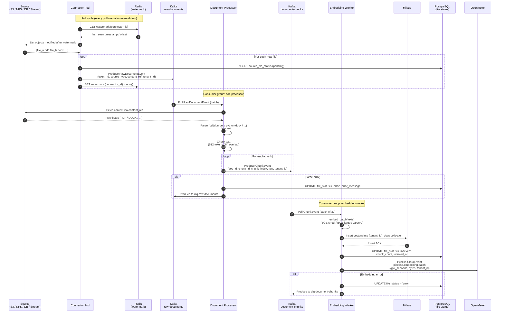
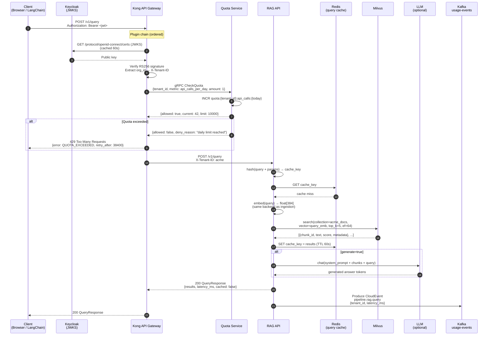
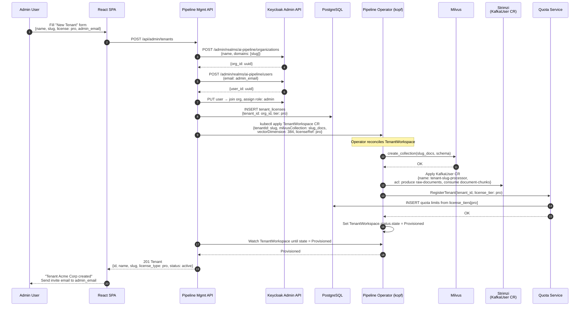
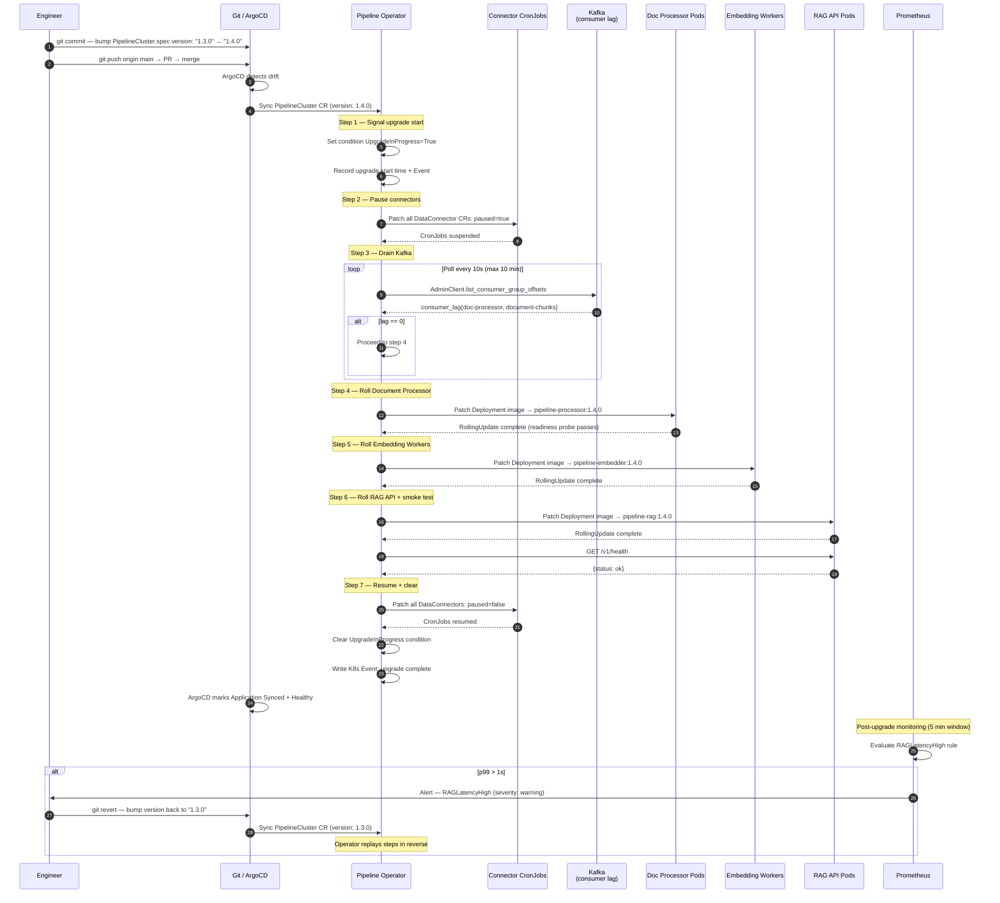

# AI Data Pipeline — Sequence Diagrams

Four key flows rendered in Mermaid. Renders natively on GitHub.

---

## 1. Document Ingestion Flow

End-to-end path from a source file arriving at a connector to its embedding being stored in Milvus.

---

## 2. RAG Query Flow

Path from a user's HTTP request through Kong, the RAG API, and back with results.

---

## 3. Tenant Provisioning Flow

Creating a new tenant end-to-end via the admin UI.

---

## 4. Coordinated Pipeline Upgrade Flow

Bumping `PipelineCluster.spec.version` triggers the Pipeline Operator's 7-step upgrade sequence.

